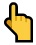
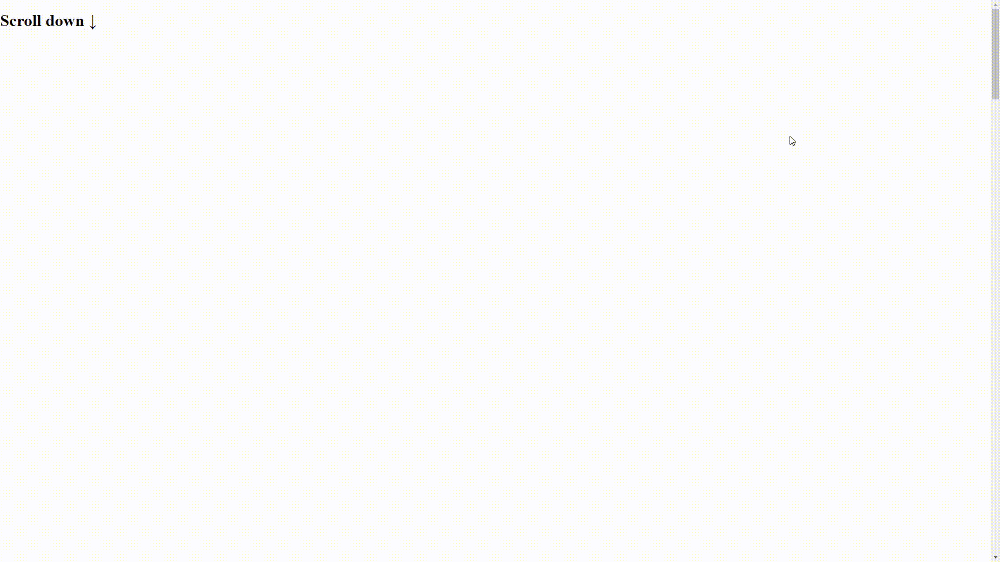

# SCROLL TO TOP
[Demo](src/index.html)
## Usage
All files you can find in __downloadMe/__ folder
### HTML
Add button with class __stt__
This is button. When you click on it, the page will scroll to top.
```
<div class='stt'></div>
```
### JS
```
<script defer src="scrollToTop-min.js"></script> 
```
The scrolling will now work. All that remains is to style the button. You can do it by yourself or connect our css file
### CSS
```
<link rel="stylesheet" href="scrollToTop.css">
```
### Stylying
You can change button styles simply by adding classes like this.
```
 <div class='stt stt__block_black'></div> 
```

| Class        | Style           | 
| ------------- |:-------------:|
| ```<div class='stt stt__block_black'></div>  ``` |  |
| ```<div class='stt stt__circle__black'></div>  ``` |  | 
| ```<div class='stt stt__emoji'></div>  ``` |  | 


<!--  -->
